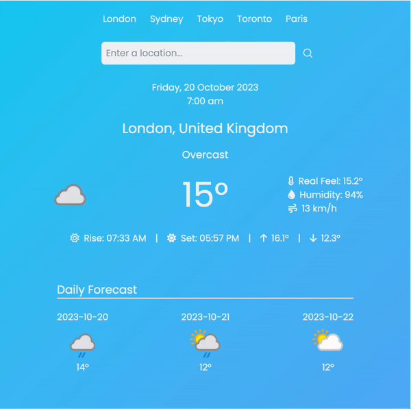

## Weather App

### Description

The Weather App is a simple and intuitive application that provides up-to-date weather information for various locations around the world. Whether you're planning a trip, checking the weather for your daily activities, or just curious about the forecast, this app has you covered. It offers real-time weather data, including temperature, humidity, wind speed, and more, in a user-friendly interface.

### Table of Contents

- [✨ Demo](#demo)
- [⚙️ Installation](#installation)
- [🤘 Features](#features)

### ✨ Demo

<div style="text-align:center">
  
</div>

### ⚙️ Installation

To use the Weather App, follow these steps:

1. **Clone the Repository:**

   ```bash
   git clone https://github.com/k-faardheen/Weather-App.git
   cd Weather-App

   ```

2. **Install Dependencies:**

   ```bash
   yarn install

   ```

3. **API Key Setup:**
   You need to obtain an API key from the [Weather Api](https://www.weatherapi.com/) website and configure it in the app. Replace **\`YOUR_API_KEY\`** in the **\`webServices.js\`** file with your actual API key.
4. **Run the App:**
   ```bash
   yarn start
   ```

### 🤘 Features

- **Location Search Bar:** This allows users to search for the weather in different locations.
- **Current Location and Weather:** The app shows the current weather for the user’s location.
- **Daily Forecast:** The app provides a daily forecast for the next few days,
